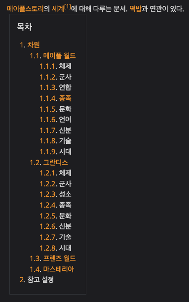
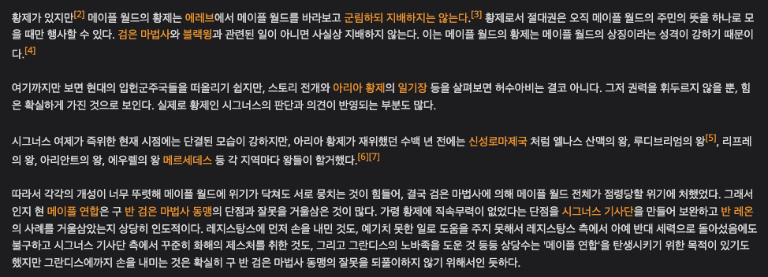

# Namu GPT

## 1. 소개
나무위키 사이트의 문서를 구조화하여 vector db의 형태로 만들어 전반적으로 langchain 기능들을 사용, RAG 기반 chatbot을 만듭니다.
초기에 설정된 url 을 설정하면 정해진 깊이나 개수만큼 recursive 하게 나무위키의 하이퍼링크를 타고 들어가며 데이터를 축적합니다. (기존 langchain 의 RecursiveUrlLoader 수정)

## 2. 테스트 실행
```consoles
poetry run python examples/example.py
```
```python
from namu_gpt.chatbot import NamuAgent

if __name__ == "__main__":
    url = "https://namu.wiki/w/메이플스토리/레벨별%20육성"
    agent = NamuAgent(url, verbose=True)

    # RAG based Q/A
    question = "메이플스토리 입문자인데. 캐릭터를 잘 육성할 수 있는 팁 좀 알려줘"
    answer = agent(question)
    answer
    # 메이플스토리에서 캐릭터를 잘 육성하기 위한 몇 가지 팁을 알려드릴게요.

    # 1. 버닝 이벤트를 활용하세요: 버닝 이벤트는 캐릭터가 레벨업할 때 추가 경험치를 얻을 수 있는 이벤트입니다. 버닝 이벤트 기간에 새로운 캐릭터를 생성하면 한 번에 3레벨이 오르므로, 육성이 빠르게 진행될 수 있습니다.

    # 2. 적절한 사냥터를 선택하세요: 사냥터는 캐릭터의 레벨에 맞게 선택하는 것이 중요합니다. 주변에 자리가 많고 지형이 좋은 곳을 선택하여 사냥하면 좋습니다. 또한, 레벨 30까지는 에델슈타인 가로등길이나 개들의 싸움터를 추천합니다.
    # ...

```

## 3. 문서 구조 
나무 위키의 문서를 아래 두 개의 구조로 표현할 수 있습니다.

### 3.a 섹션 구조
나무 위키의 대부분의 문서는 아래 이미지와 같이 목차에 따른 섹션 구분 형태를 갖고 있습니다. 하나의 링크(url)은 하나의 topic을 아우르는 문서이며, 각 섹션은 sub-topic 에 대한 문서임을 알 수 있습니다. 하나의 긴 문서를 sequence length 단위로 저장하는 것보다 이러한 방식으로 section 단위의 문서로 저장하는 것은 정보 해상도를 높힐 수 있는 방식이 됩니다.
<details>
<summary>나무 위키 목차 이미지</summary>


</details>

### 3.b 하이퍼링크 구조
나무 위키는 방대한 정보 생태계를 갖고 있는 플랫폼이기에, 하나의 나무 위키 문서는 그 안에서 다른 나무 위키 문서를 참조하는 경우가 많습니다. 문서(A) 하나를 이해하기 위해서 다른 문서(B)를 참조해야 하는 경우는 B가 A의 부모 문서라고 이야기할 수 있습니다. (B $\rightarrow$ A) 현재 상태에서는 retriever에게 이러한 계층 구조를 알려주지는 못한 상태이며 (document를 확장하기(enrich) 하기 위해서만 하이퍼링크가 사용됨), 이는 future works로 남겨 추후 해결하려 합니다.
<details>
<summary>나무 위키 하이퍼링크 이미지</summary>


</details>

## 구조
* constant.py : 모델 선택에 대한 설정값이 들어있습니다.
* crawler.py : langchain의 RecursiveUrlLoader을 나무 위키 포맷에 맞게 수정한 스크립트입니다.
* document.py : 나무 위키 데이터를 크롤링하고 데이터를 모델에 넣기 전에 전처리(cleanse, tokenize) 하여 langchain 의 Document 객체로 변환하는 과정입니다.
* retriever.py : 나무 위키 document 가 준비되었으면, 해당 데이터를 사용해서 langchain 의 MultiRetrievalQAChain 모듈을 사용, RAG based QA 봇을 만듭니다.
* chatbot.py : retriever가 이전 대화 로그를 기억하면서 대화할 수 있도록 langchain의 ChatMessageHistory을 사용, 전반적 모듈을 감싸주는 wrapper입니다.
